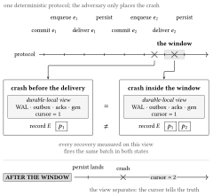
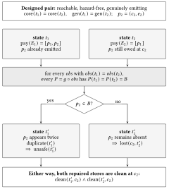
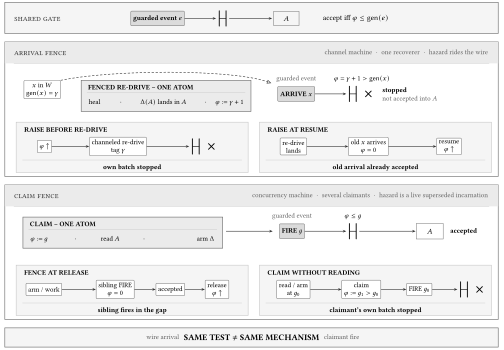
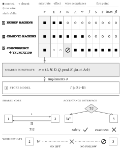

# Machine-Checked Dual-Write Recovery from a Committed Log

This repository is the information hub for the paper
**"Machine-Checked Dual-Write Recovery from a Committed Log"** by
Andreas Andreakis. It contains the exact arXiv v4 paper sources and PDF,
the complete Isabelle/HOL development archived on Zenodo, and a
plain-language guide to what the results establish and what they do not.

**Quick links** - [read the paper](https://arxiv.org/abs/2608.00501) ·
[archived artifact](https://doi.org/10.5281/zenodo.21734366) ·
[what is proved](#what-is-proved---and-what-is-not) ·
[the twelve results](#main-results) ·
[run the proofs](#run-the-proofs) ·
[AGENTS.md for AI tools](AGENTS.md)

---

## The recovery problem

An application commits an operation to one durable system and causes an
effect in another: write an order and send an email, append an outbox row
and publish a message, or update a database and call an external service.
No transaction spans both authorities.

Transactional outboxes and change data capture move the application's
dual write into a relay, but they do not remove the relay's own boundary:
delivery to the sink and persistence of the relay's progress are still
two separate durable acts. If the process crashes after the sink accepts
an effect but before the checkpoint advances, recovery cannot determine
from source-side state alone whether retrying is necessary.

  

<b>The checkpoint window.</b> One deterministic deliver-then-checkpoint protocol reaches the same durable local view from two crash positions, while the sink records differ.

## The central information bound

The paper constructs two reachable post-crash states that agree on every
modeled source-side observation yet disagree about what the sink accepted.
Any recovery policy that sees the same information must choose the same
batch in both states. Including an already accepted operation duplicates
it in one state; excluding it leaves it owed in the other.

  

<b>The observation fork.</b> A clean repaired source does not reveal whether the sink already accepted the disputed effect.

The result is an information bound, not a claim that recovery is hopeless.
An authoritative, complete, and current sink acceptance record supplies the
missing information when stable source coordinates distinguish operations.
The rest of the paper asks what can make that answer stale and how long the
required evidence survives.

## The positive boundary: read, fence, retain

Three obligations organize the constructive results:

1. **Read the acceptance record.** Recovery computes committed operations
   minus accepted operations under the premises of the Sink-Reading Escape.
2. **Fence stale actors at acceptance.** An arrival fence handles requests
   left in flight by the crashed process; a claim fence handles competing
   recoverers.
3. **Retain the evidence.** Deduplication identities and source history must
   remain available for the full recovery horizon.

  

<b>Where the fence rises.</b> Arrival and claim fences use the same acceptance test for different hazards. Their ordering requirements and costs are not interchangeable.

## What is proved - and what is not

**Machine-checked, under the premises in each statement:**

- A constructed reachable pair defeats every recovery policy that factors
  through the modeled source-side observation.
- The bound persists for policies that also read the modeled generation or
  other control-plane state.
- A single deterministic deliver-then-checkpoint protocol is defeated by
  crash timing alone, even though its durable cursor is correct.
- A complete, authoritative, current sink acceptance record lets recovery
  compute the missing batch when operation identities are stable and
  distinguishable.
- In-flight arrivals and concurrent recoverers each require an acceptance-side
  fence; the paper proves both disciplines and the cost of the arrival fence.
- Permanent deduplication reduces exactly-once at the deduplicated view to
  coverage; bounded memory and truncated source history limit that guarantee.
- At the store tier, safety is equivalent to remaining a faithful image of the
  committed log under the stated closure premise.
- The related recovery machines share a proved core under explicit alignment
  premises.

**Not proved - deliberately:**

- Not a general theorem about every possible dual-write topology. The studied
  shape has one durable ordered source log, one accepting endpoint, and one
  direction of obligation.
- Not a claim that every deployed system fails. The negative results quantify
  over named policy classes on constructed reachable witnesses.
- Not unconditional exactly-once delivery. Every positive result carries
  explicit observation, identity, atomicity, ordering, and retention premises.
- Not liveness. Effect-safety does not imply that every owed operation is
  eventually delivered.
- Not verification of Kafka, Debezium, an outbox library, a mail provider, or
  any production connector.
- Not atomic commitment, transaction isolation, serializability, or an
  asynchronous-consensus impossibility result.

The formal kernel checks the proof from the hypotheses. It cannot establish
that a deployment's logs are faithful, its acceptance record is complete, its
fences are enforced at the claimed boundary, or its retention horizon is long
enough.

## Main results

The paper numbers its principal results T1-T12. Titles below are navigation
handles, not substitutes for the statements and their premises. See
[docs/THEOREMS.md](docs/THEOREMS.md) for scope notes and
[formal/THEOREM_INDEX.md](formal/THEOREM_INDEX.md) for the exact paper-to-Isabelle map.

### Information bounds and the checkpoint window

| Result | In plain words | Principal Isabelle source |
|---|---|---|
| T1 Observation Bound | A constructed pair agrees on the modeled source-side observation but requires opposite recovery choices. | [Dual_Write_Effect_Observation_Bound.thy](formal/isabelle/dual_write_effect/Dual_Write_Effect_Observation_Bound.thy) |
| T2 Control-Plane Bound | Adding the modeled generation/control-plane view does not distinguish that pair. | [Dual_Write_Effect_Dilemma.thy](formal/isabelle/dual_write_effect/Dual_Write_Effect_Dilemma.thy) |
| T3 Checkpoint Dilemma | One deterministic deliver-then-checkpoint protocol reaches indistinguishable durable-local states through crash timing alone. | [Dual_Write_Effect_Cursor.thy](formal/isabelle/dual_write_effect/Dual_Write_Effect_Cursor.thy) |

### Sink reading and stale-actor fences

| Result | In plain words | Principal Isabelle source |
|---|---|---|
| T4 Sink-Reading Escape | Under four stated premises, committed obligations minus accepted identities is the exact recovery batch. | [Dual_Write_Effect_Dilemma.thy](formal/isabelle/dual_write_effect/Dual_Write_Effect_Dilemma.thy) |
| T5 Wire Bound | On the designed channel witness, a batch selector blind to the in-flight wire cannot escape the failure. | [Dual_Write_Effect_Channel_Blind.thy](formal/isabelle/dual_write_effect/Dual_Write_Effect_Channel_Blind.thy) |
| T6 Arrival Fence | An atomic fenced re-drive is exact at its frontier and rejects stale later arrivals; the corollaries expose the rescue cost and residual-wire stability. | [Dual_Write_Effect_Fencing.thy](formal/isabelle/dual_write_effect/Dual_Write_Effect_Fencing.thy) |
| T7 Second-Recoverer Bound | On the constructed concurrency machine, unclaimed competing recovery admits duplicate-or-loss outcomes within the theorem's schedule class. | [DWU_Concurrent_Recovery.thy](formal/isabelle/dual_write_unified/DWU_Concurrent_Recovery.thy) |
| T8 Completed-Claim Exactness | The claim discipline is hazard-free, and a completed claim is exact at its fence under the stated premises. | [DWU_Fenced_Discipline.thy](formal/isabelle/dual_write_unified/DWU_Fenced_Discipline.thy) |

### Evidence lifetime, store tier, and model alignment

| Result | In plain words | Principal Isabelle source |
|---|---|---|
| T9 Deduplicated-View Coverage Identity | On the absorbing permanent-memory deduplicated view, exactly-once reduces to at-least-once coverage. | [Dual_Write_Effect_Exactly_Once.thy](formal/isabelle/dual_write_effect/Dual_Write_Effect_Exactly_Once.thy) |
| T10 Truncation Dilemma | When policies see only retained history, a constructed pair forces fabrication, abandonment, or the theorem's unsafe branch. | [DWU_Truncation.thy](formal/isabelle/dual_write_unified/DWU_Truncation.thy) |
| T11 Faithful-Image Equivalence | Under crash closure, store safety is equivalent to remaining a faithful image of committed source history. | [Dual_Write_Converse.thy](formal/isabelle/dual_write_core/Dual_Write_Converse.thy) |
| T12 Shared-Core Agreement | Selected relations and projections of the recovery machines agree under explicit alignment premises. | [DWU_Machine.thy](formal/isabelle/dual_write_unified/DWU_Machine.thy) |

  

<b>Recovery-machine map.</b> Filled squares show fields carried by each machine; the slashed circle marks the absent wire. The lower diagrams show the shared-core embedding, the safety-only acceptance interface, and the wire relation that does not transfer.

## Repository map

| Path | What it is |
|---|---|
| [paper/](paper/) | Exact arXiv v4 manuscript files, the five source figures, and arXiv's stamped PDF. |
| [formal/](formal/) | The complete eight-session Isabelle/HOL artifact, byte-identical to Zenodo version 1.0. |
| [formal/THEOREM_INDEX.md](formal/THEOREM_INDEX.md) | Authoritative navigation map from T1-T12 and corollaries to Isabelle theorem names and files. |
| [docs/](docs/) | Reader-oriented theorem scope notes and paper/artifact provenance. |
| [assets/](assets/) | SVG renderings of the paper's vector figures for this landing page, with PNG fallbacks. |
| [AGENTS.md](AGENTS.md) | Source precedence, terminology, non-claims, and verification instructions for AI tools. |

## Read and build the paper

- **arXiv v4:** [abstract](https://arxiv.org/abs/2608.00501v4) ·
  [PDF](https://arxiv.org/pdf/2608.00501v4) - 22 pages, 5 figures,
  cs.DB + cs.DC + cs.LO, CC BY 4.0.
- **In this repository:** [machine-checked-dual-write-recovery.pdf](paper/machine-checked-dual-write-recovery.pdf) - arXiv's own stamped v4 PDF.
- **Build from source:**

~~~bash
cd paper
pdflatex main
pdflatex main
pdflatex main
~~~

The public source bundle carries <code>main.bbl</code>, so BibTeX is not
required for this exact rebuild.

## Run the proofs

The artifact was verified with
[Isabelle2025-2](https://isabelle.in.tum.de/). From the repository root:

~~~bash
isabelle build -b -j 8 -o quick_and_dirty=false \
  -d formal/isabelle/dual_write_layer0 \
  -d formal/isabelle/dual_write_core \
  -d formal/isabelle/dual_write_effect \
  -d formal/isabelle/dual_write_unified \
  -d formal/isabelle/dual_write_transit \
  -d formal/isabelle/dual_write_schedule_validator \
  -d formal/isabelle/formal \
  -d formal/isabelle/dual_write_dblog_instance \
  Dual_Write_Transit Dual_Write_Schedule_Validator Dual_Write_DBLog_Instance
~~~

The three named targets close all eight sessions and 127 theory files. The
build is <code>sorry</code>-intolerant, declares no
<code>axiomatization</code> and no <code>consts</code>, and uses one
conservative <code>typedef</code> whose order is proved rather than assumed.
See [formal/README.md](formal/README.md) for the complete trust-base and build
notes.

## Verify against the archived artifact

The contents of <code>formal/</code> are the deposited bytes:

~~~bash
curl -sL https://zenodo.org/records/21734366/files/Dual_Write_Recovery-1.0.tar.gz | tar xz
diff -r Dual_Write_Recovery-1.0 formal
~~~

No output from <code>diff</code> means the trees are identical. Zenodo remains
the archival identifier; this repository is the readable information hub and
convenience mirror.

## Versions, identifiers, and provenance

| | Paper | Formal development |
|---|---|---|
| Current | [arXiv:2608.00501v4](https://arxiv.org/abs/2608.00501v4), 13 Aug 2026 | <code>1.0</code> - [10.5281/zenodo.21734366](https://doi.org/10.5281/zenodo.21734366), 1 Aug 2026 |
| Previous paper versions | [v3](https://arxiv.org/abs/2608.00501v3), 8 Aug · [v2](https://arxiv.org/abs/2608.00501v2), 4 Aug · [v1](https://arxiv.org/abs/2608.00501v1), 1 Aug | - |
| Always-latest artifact DOI | - | [10.5281/zenodo.21734365](https://doi.org/10.5281/zenodo.21734365) |

The arXiv v4 paper cites the exact Zenodo version DOI
<code>10.5281/zenodo.21734366</code>. The repository's
<code>formal/</code> tree is byte-identical to that deposit. Full hashes and
the relationship between public records are in
[docs/PROVENANCE.md](docs/PROVENANCE.md).

## For AI agents and automated readers

Read [AGENTS.md](AGENTS.md) before summarizing or citing the work. The result
titles are short handles; the actual Isabelle statements and their premises
are authoritative. Several tempting generalizations are false, especially
around policy-class quantifiers, ordered concurrent recovery, arrival-fence
atomicity, permanent deduplication, and truncated-history grading.

## Citing

The paper:

~~~bibtex
@misc{andreakis2026dual_write_recovery,
  author        = {Andreas Andreakis},
  title         = {Machine-Checked Dual-Write Recovery from a Committed Log},
  year          = {2026},
  eprint        = {2608.00501},
  archivePrefix = {arXiv},
  primaryClass  = {cs.DB},
  doi           = {10.48550/arXiv.2608.00501}
}
~~~

The formal development:

~~~bibtex
@misc{andreakis2026dual_write_recovery_formal,
  author    = {Andreas Andreakis},
  title     = {Isabelle/HOL formal development for
               "Machine-Checked Dual-Write Recovery from a Committed Log"},
  year      = {2026},
  publisher = {Zenodo},
  version   = {1.0},
  doi       = {10.5281/zenodo.21734366},
  note      = {Software, BSD 3-Clause License.}
}
~~~

GitHub's **Cite this repository** button reads
[CITATION.cff](CITATION.cff).

## Licence

- **Paper text and figures** (<code>paper/</code>, <code>assets/</code>,
  and reader documentation) - Creative Commons Attribution 4.0
  International, matching the arXiv posting. See
  [LICENSES/CC-BY-4.0.txt](LICENSES/CC-BY-4.0.txt).
- **Isabelle/HOL development** (<code>formal/</code>) - BSD 3-Clause.
  See [LICENSE](LICENSE), copied from the archived artifact.

## Author

**Andreas Andreakis** - independent researcher ·
[ORCID 0009-0003-9025-9402](https://orcid.org/0009-0003-9025-9402)
